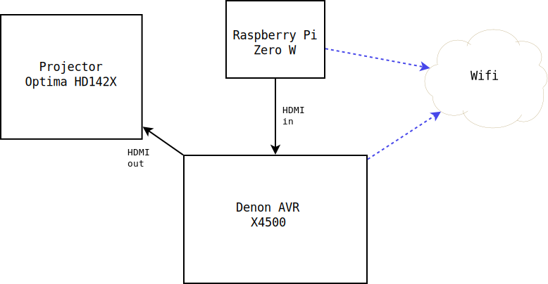

# fix-cec

Get a Denon AVR to automatically power on/off an Optima projector.

## Introduction

I found that when I powered on my Denon AVR (X4500) the Optima (HD142X)
projector that it was connected to would not automatically switch on. This
*should* work.  But the HDMI protocol involved (called "CEC") is often
not reliable, especially when combining products from different brands
(Denon and Optima in this case).

## Overview of solution

I connected a Raspberry Pi to one of the Denon AVR's HDMI inputs.
I configured networking on the Denon AVR and the Raspberry Pi
so that the Raspberry Pi could connect to the Denon AVR's IP
address.

 

Running the code (main.cc) on the Raspberry Pi means that the Pi
will notice when the Denon AVR is switched on and it will then
switch on the Optima projector. Similarly, when the Denon AVR
is switched off, the Pi will notice and switch off the Optima
projector.

## Setting up the Denon AVR

You will need to configure some settings on the Denon AVR.

### Set up networking

Make sure the Denon is connected to your network. I did this
by going ito the Setup Menu->Network->Connection and configuring
the WiFi connection. I gave the unit a static IP address
(192.168.1.45) so that the Pi would have a predictable IP
address to connect to.

I also set Setup Menu->Network->Network Control to be "Always On".
This means that the Pi can connect to the AVR even when it
is switched off.

### Set up CEC

In Video/HDMI Setup I have set:

* HDMI Control = On
* Power Off Control = All
* RC Source Select = Power On + Source

## Setting up the Raspberry Pi

I used a Raspberry Pi Zero W. I connected it to one of the space HDMI
inputs on the back of the AVR.  I installed Raspbian 10 on it. I
configured networking so that it was able to connect to the Denon
AVR's IP.

### Install software on Pi

You need to have a C++ Complier installed

```
sudo apt install g++
```

Also, the make utility

```
sudo apt install make
```

install git

```
sudo apt install git
```

and also some libraries related to HDMI/CEC

```
sudo apt install libraspberrypi-dev libraspberrypi0
sudo apt install cec-utils libcec4
```

### Configure /boot/config.txt

Add the following setting to the file `/boot/config.txt`

```
hdmi_ignore_cec_init=1
```

and reboot.

# Download `fix-cec`

```
git clone https://github.com/stuart-mclaren/fix-cec
```
## Building `fix-cec`

### Edit main.cc to set the IP address

First, before compiling you will need to edit the file `main.cc` to
enter the IP address of your Denon AVR.

Change this line:

```
#define ip_address "192.168.1.45"
```

to match your Denon AVR's IP address. Eg if the IP
address is `192.168.0.100` change the line to:

```
#define ip_address "192.168.0.100"
```

### Compiling `fix-cec`

To compile the code, run the following (from inside the `fix-cec`
directory):

```
make
```

This will create the file `fix-cec`.

### Installing `fix-cec`

```
sudo make install
```

This will copy the binary to `/usr/local/bin/fix-cec` and configure a systemd
service called `fix-cec` to run the binary automatically when the Pi boots.

You can check the service is correctly starting on boot by rebooting
the Pi


```
sudo reboot
```

and then, once the Pi has booted, running:

```
systemctl status fix-cec
```

If it's working, the output should show:

```
● fix-cec.service - fix-cec service
   Loaded: loaded (/etc/systemd/system/fix-cec.service; enabled; vendor preset: enabled)
   Active: active (running) since Sun 2022-01-16 15:57:53 GMT; 6min ago
 Main PID: 394 (fix-cec)
    Tasks: 5 (limit: 421)
   CGroup: /system.slice/fix-cec.service
           └─394 /usr/local/bin/fix-cec
Jan 16 16:03:03 piston fix-cec[394]: Connected
Jan 16 16:03:03 piston fix-cec[394]: DPX: SKIP
Jan 16 16:03:03 piston fix-cec[394]: DPSI: SI=5
Jan 16 16:03:03 piston fix-cec[394]: DP: PSTRE 50
Jan 16 16:03:03 piston fix-cec[394]: DPX: SKIP
Jan 16 16:03:03 piston fix-cec[394]: DPSI: SI=5
Jan 16 16:03:03 piston fix-cec[394]: DP: PSTONE CTRL OFF
Jan 16 16:03:03 piston fix-cec[394]: DPX: SKIP
Jan 16 16:03:03 piston fix-cec[394]: DPSI: SI=5
Jan 16 16:03:03 piston fix-cec[394]: DP: SSSMG MOV
Jan 16 16:03:03 piston fix-cec[394]: DPX: SKIP
```

Note the "Connected" message: this means the Pi connected to the AVR's
IP address successfully. The various DP messages are output from the AVR.
The DPX messages are debug.

# A note on logging

The code logs *a lot*. You will need to make sure that logs, eg
in /var/log are rotated to avoid filling up the filesystem.

Alternatively, remove the various `printf` statements from `main.cc`.

# Can I avoid the projector turning on in some cases?

In some cases, eg when using a turntable or the tuner, you may not want
the projector to switch on when you turn on the AVR.

See the following note in the code for how to change this behaviour:

```
Note: For non-video sources
```

Basically add `100` to the source that you don't want to power on the
projector for. Eg to prevent the projector turning on when playing vinyl
records change this line:

```
phono = 9,
```
to this

```
phono = 109,
```

This assumes that you have the following set on the AVR

```
RC Source Select = Power On + Source
```

and you power on the AVR by pressing the `Phono` button
on the AVR's remote control.

# Acknowledgments

The code is based on https://github.com/glywood/cec-fix
